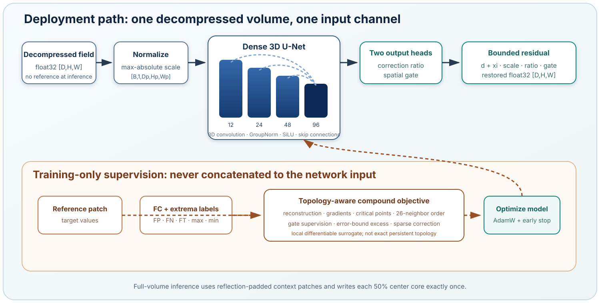

<p align="center">
  
</p>

<p align="center">
  <a href="https://github.com/ExploreXploitQ/DenseTopo-UNet/actions/workflows/ci.yml"></a>
  
  
  
</p>

# DenseTopo-UNet

DenseTopo-UNet is an alpha research package for learning bounded corrections to three-dimensional scalar fields after lossy decompression. Its gated residual 3D U-Net receives one already decompressed field and predicts where and how strongly that field should be edited to reduce false critical points (FCs).

> **Evidence status:** The architecture, training pipeline, single-volume inference, metrics, and deterministic software check are implemented. No pretrained checkpoint, research dataset, compressor-produced benchmark, or verified FC-reduction result is included. The 90% FC-reduction target is a research objective, not a repository-level performance claim.

## Method at a glance

At deployment time, the only scientific input is a headerless `float32` decompressed volume with logical shape `[D, H, W]`. It becomes one neural-network input channel with batch shape `[B, 1, D, H, W]`; the channel stores the normalized scalar value, not an image color or a topology label.

The encoder learns 12, 24, 48, and 96 internal feature channels by default. These feature channels are latent pattern detectors and have no fixed physical meaning. The decoder returns two output logits: correction logit `c` and gate logit `a`. For decompressed value `d`, absolute error bound `xi`, and configured correction scale `s`, the output is

```text
restored = d + xi * s * tanh(c) * sigmoid(a)
```

Reference volumes and topology labels supervise patch selection and losses during training only. They are not model input channels and are not accepted by the inference command.



## Supported data boundary

DenseTopo-UNet reads reconstructed floating-point fields, not compressed bitstreams. SPERR, SZ3, ZFP, MGARD, and HPEZ are examples of possible upstream lossy compressors. The repository does not claim validation on their outputs; users must decompress with the upstream tool, export the result to the documented raw format, generate training labels with an external topology evaluator, and train a checkpoint for a scientifically coherent setting.

The initial format is deliberately strict:

- headerless IEEE-754 `float32`;
- little- or big-endian, declared explicitly;
- C-contiguous `zyx` storage, with `x` changing fastest;
- logical dimensions `[D, H, W]`;
- exactly `D * H * W * 4` bytes per file.

See the [data contract](docs/data-contract.md) and [topology-label specification](docs/topology-labels.md) before preparing a manifest.

## Installation

DenseTopo-UNet requires Python 3.10 or newer. Install PyTorch for the target CPU or CUDA platform first, then install this project:

```bash
git clone https://github.com/ExploreXploitQ/DenseTopo-UNet.git
cd DenseTopo-UNet
python -m pip install -e .
```

For local development:

```bash
python -m pip install -e '.[dev]'
make check
```

The package respects PyTorch-visible devices. Select permitted GPUs through the normal environment mechanism before starting the command; the package does not override global GPU visibility.

## Deterministic software check

The repository can generate a small analytic example, train for two CPU epochs, inspect the checkpoint, and run inference:

```bash
bash scripts/smoke_test.sh artifacts/smoke-001
```

The generated perturbation is a deterministic lossy-decompression proxy. It is not output from SPERR, SZ3, ZFP, MGARD, HPEZ, or another named compressor, and a successful run demonstrates software integration rather than topology-restoration accuracy.

## Train your own model

Users supply an experiment configuration and a manifest. Training and validation records contain a decompressed field, its reference field, an FC label CSV, and a reference-extrema CSV. Test records may contain only a decompressed field when they are reserved for deployment-like inference.

```bash
densetopo validate-manifest \
  --config configs/model.yaml \
  --manifest path/to/manifest.yaml

densetopo train \
  --config configs/model.yaml \
  --manifest path/to/manifest.yaml \
  --output runs/experiment-001
```

The default configuration allows up to 1,000 epochs and activates early stopping only after epoch 300, with a patience of 120 validation epochs. These are convergence-oriented defaults, not a guaranteed training duration. Runtime depends on volume size, patch count, feature width, storage speed, and GPU performance.

No trained weights are bundled or downloaded. A run directory records the resolved configuration, environment, manifest fingerprint, loss history, best and latest checkpoints, and training summary.

## Restore one decompressed volume

Inference requires no original reference field and no topology files:

```bash
densetopo infer \
  --checkpoint runs/experiment-001/best.pt \
  --input path/to/one.lossy.f32 \
  --shape D H W \
  --byte-order little \
  --output path/to/one.restored.f32 \
  --device auto
```

The checkpoint supplies normalization, model, error-bound, and patch settings. Context tiling uses a center core equal to 50% of each patch dimension, giving the requested 50% core stride while writing every output voxel exactly once. The command also writes a provenance JSON file beside the restored volume.

## Evaluate FC reduction

Numerical evaluation compares decompressed and restored fields against manifest references. FC evaluation aggregates `FP`, `FN`, and `FT` counts produced by an external topology extractor:

```bash
densetopo evaluate \
  --config configs/model.yaml \
  --manifest path/to/manifest.yaml \
  --restored-root path/to/restored \
  --split test \
  --baseline-topology-dir path/to/baseline-fc-json \
  --restored-topology-dir path/to/restored-fc-json \
  --output runs/evaluation-001
```

The package does not calculate persistence or contour trees. Its differentiable 26-neighbor ordering term is a local training surrogate, so persistent-topology correctness must be measured independently.

## Documentation

- [Documentation index](docs/index.md)
- [Architecture and tensor channels](docs/architecture.md)
- [Data contract](docs/data-contract.md)
- [Experiment configuration](docs/configuration.md)
- [Training, inference, and evaluation](docs/usage.md)
- [Topology labels and FC summaries](docs/topology-labels.md)
- [Reproducibility](docs/reproducibility.md)
- [Limitations and evidence status](docs/limitations.md)
- [Model card](MODEL_CARD.md)

## Repository layout

```text
src/densetopo_unet/   installable Python package
configs/              generic and synthetic YAML examples
scripts/              deterministic workflow utilities
tests/                unit and end-to-end CPU tests
docs/                 technical documentation
assets/               repository-native SVG figures
```

## Contributing, citation, and security

See [CONTRIBUTING.md](CONTRIBUTING.md) for code and evidence requirements, [SECURITY.md](SECURITY.md) for private vulnerability reporting, and [CITATION.cff](CITATION.cff) for versioned software citation metadata. Participation is governed by [CODE_OF_CONDUCT.md](CODE_OF_CONDUCT.md).

## License status

This repository does not currently contain a license grant. Standard copyright restrictions apply. Citation does not grant permission to copy, modify, or redistribute the software.
